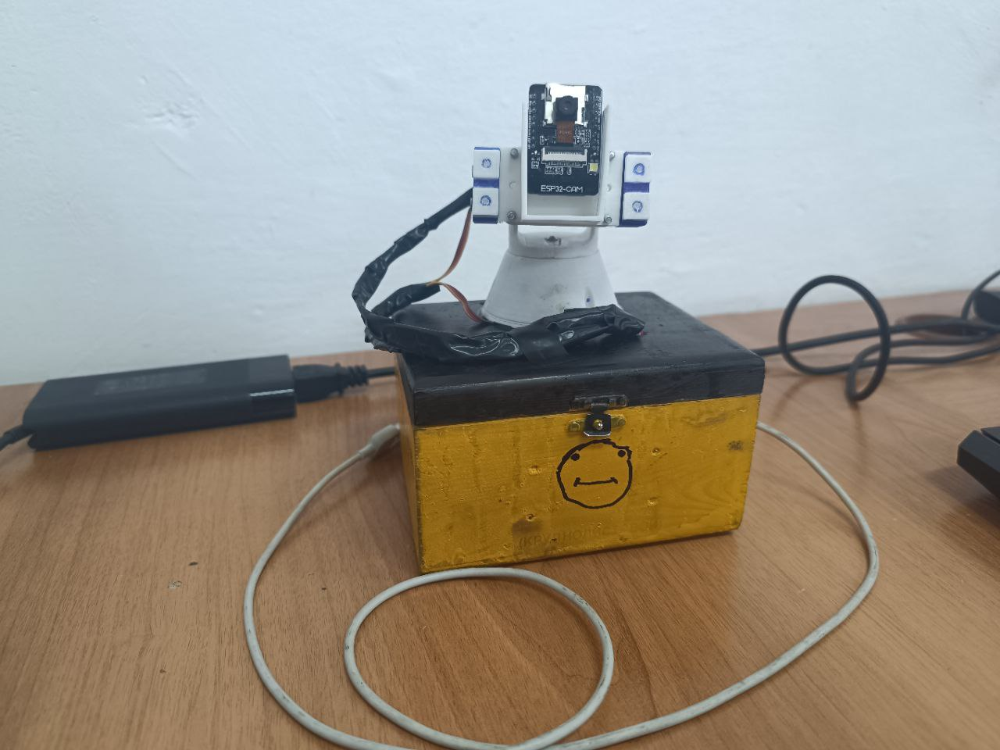

## Auto-guidance-system
Система автоматического наведения представляет собой устройство,  созданное для автоматизированного наведения на объекты, помеченные лазерным  целеуказателем. 

## Что это и к чему
Данный проект разрабатывался для курсовой, он был очень долгим и очень сложным, по этому я обязан его добавить сюда

## Примечания

Как подключить, как работает и другое, все это описано в документации.